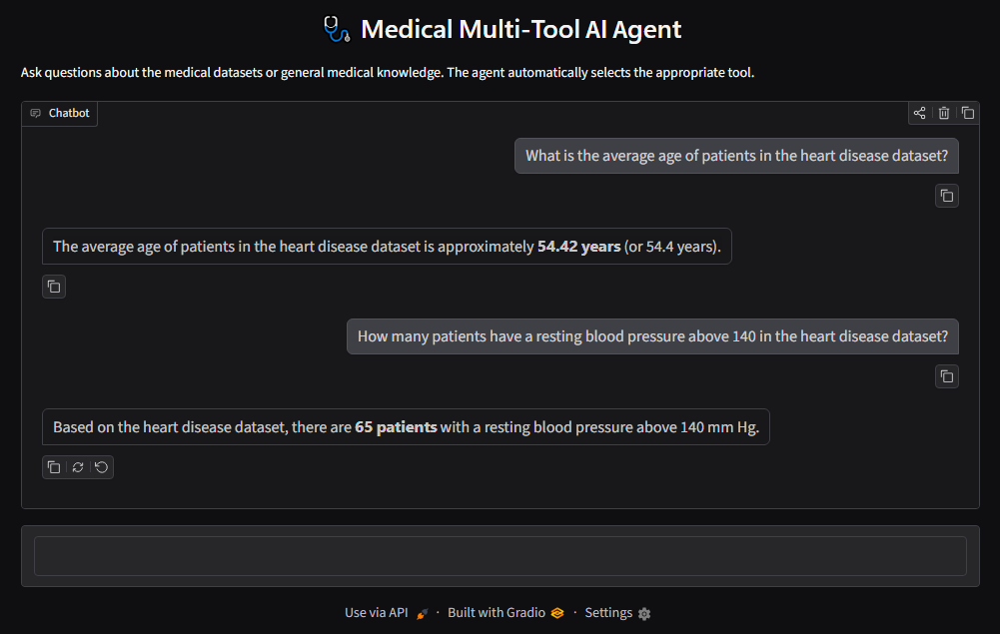
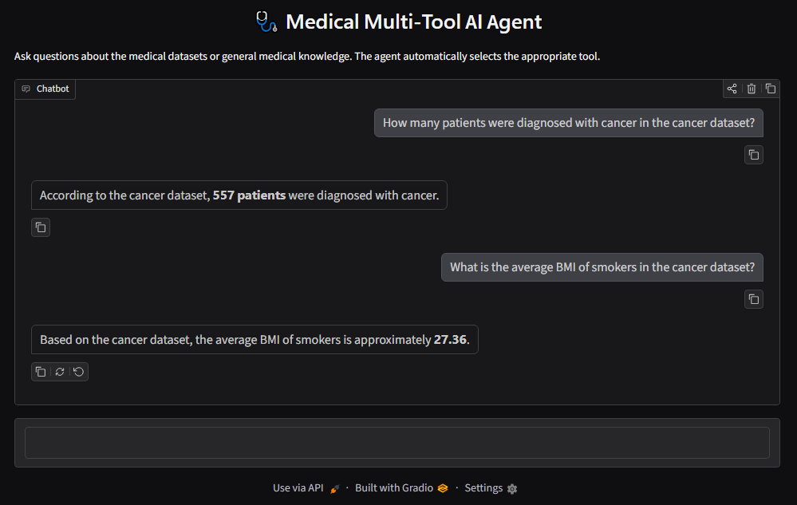
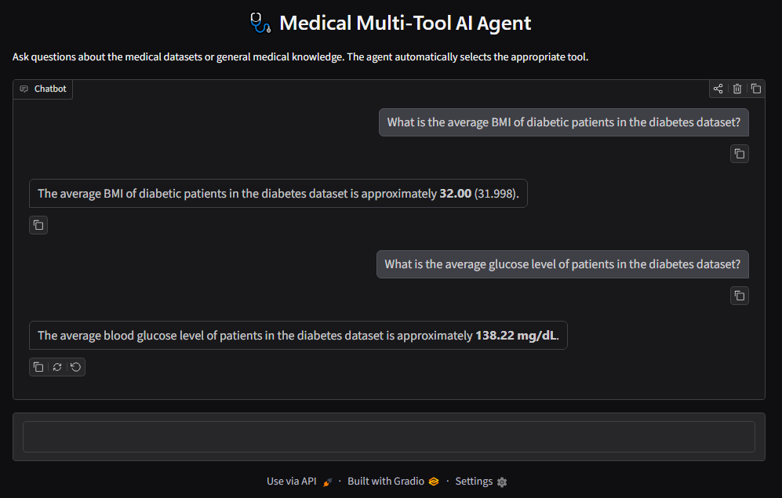
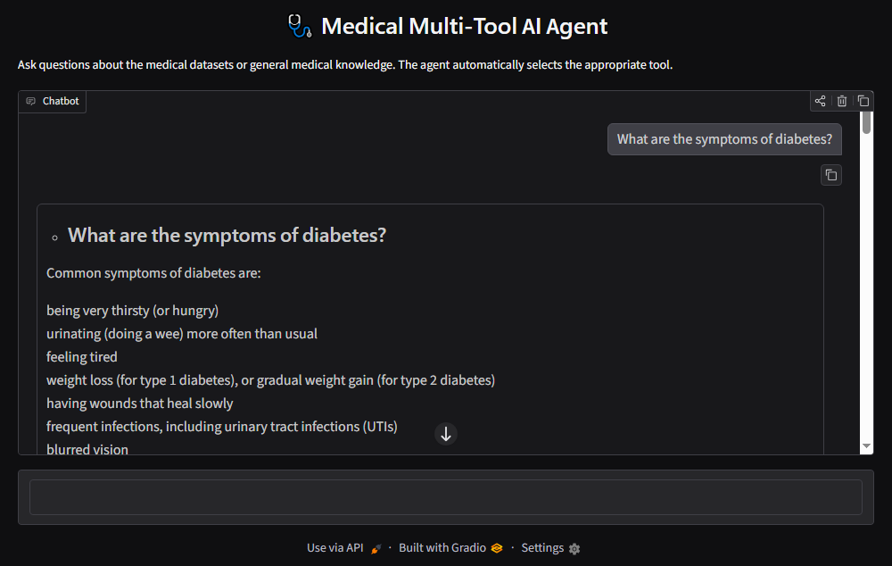
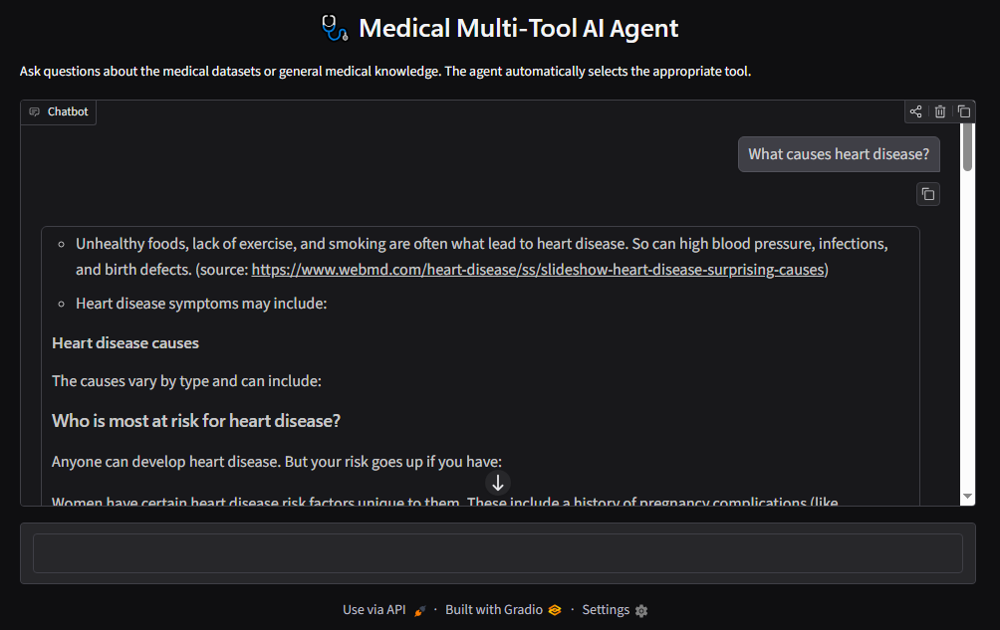

# Medical Multi-Tool AI Agent

<p align="center">
  
  
  
  
  
  
  
  
</p>

---

A LangChain-based **Medical Multi-Tool AI Agent** that intelligently routes user questions to the appropriate medical dataset or web-search tool.

The agent can answer:

* 📊 Dataset-specific statistical questions
* ❤️ Heart disease dataset queries
* 🎗️ Cancer dataset queries
* 🩺 Diabetes dataset queries
* 🌐 General medical knowledge questions
* 🔎 Medical definitions, symptoms, causes, and general treatment information

The project uses **Google Gemini** as the LLM, **SQLite** for structured medical datasets, **Tavily/DuckDuckGo** for web search, **LangChain/LangGraph** for agent orchestration, and **Gradio** for the web-based user interface.

---

## 📌 Table of Contents

* [Project Overview](#-project-overview)
* [Key Features](#-key-features)
* [Application Demo](#-application-demo)
* [Architecture](#-architecture)
* [How the Agent Works](#-how-the-agent-works)
* [Datasets](#-datasets)
* [Technology Stack](#-technology-stack)
* [Project Structure](#-project-structure)
* [Prerequisites](#-prerequisites)
* [Installation](#-installation)
* [Environment Variables](#-environment-variables)
* [Kaggle Configuration](#-kaggle-configuration)
* [Build the Databases](#-build-the-databases)
* [Run the Application](#-run-the-application)
* [Example Queries](#-example-queries)
* [Verified Application Results](#-verified-application-results)
* [Tool Routing](#-tool-routing)
* [Google Gemini](#-google-gemini)
* [Web Search](#-web-search)
* [Tavily Integration Note](#-tavily-integration-note)
* [SQL Safety](#-sql-safety)
* [Testing](#-testing)
* [Code Quality](#-code-quality)
* [Continuous Integration](#-continuous-integration)
* [Requirements Files](#-requirements-files)
* [Makefile](#-makefile)
* [Important Python Files](#-important-python-files)
* [Test Architecture](#-test-architecture)
* [Gemini Free-Tier Quota](#-gemini-free-tier-quota)
* [Medical Safety Disclaimer](#-medical-safety-disclaimer)
* [Known Limitations](#-known-limitations)
* [Future Improvements](#-future-improvements)
* [Security Best Practices](#-security-best-practices)
* [Project Status](#-project-status)
* [Development Workflow](#-development-workflow)
* [Learning Objectives](#-learning-objectives)
* [License](#-license)
* [Author](#-author)
* [Final Notes](#-final-notes)

---

## 🎯 Project Overview

The **Medical Multi-Tool AI Agent** demonstrates how an AI agent can interact with multiple data sources and select the appropriate tool based on the user's question.

Instead of sending every question directly to the Internet, the agent determines whether the user is asking about:

1. A specific medical dataset
2. General medical knowledge

For dataset-related questions, the agent uses SQLite databases generated from Kaggle CSV datasets.

For general medical questions, the agent uses a medical web-search tool.

The project provides two ways to interact with the agent:

* **CLI:** `main.py` for terminal-based interaction
* **Web UI:** `app.py` using Gradio

### Example

If the user asks:

> What is the average age in the heart disease dataset?

The agent routes the question to:

```text
heart_disease_db_tool
        ↓
heart_disease.db
        ↓
SQL query
        ↓
Result
```

If the user asks:

> What causes heart disease?

The agent routes the question to:

```text
medical_web_search_tool
        ↓
Tavily / DuckDuckGo
        ↓
Web results
        ↓
Medical information + disclaimer
```

---

## ✨ Key Features

* 🤖 AI-powered tool selection using Google Gemini
* 🧠 LangChain agent orchestration
* 🗄️ SQLite databases for medical datasets
* ❤️ Heart disease dataset tool
* 🎗️ Cancer dataset tool
* 🩺 Diabetes dataset tool
* 🌐 General medical web-search tool
* 🔎 Tavily as the primary web-search backend
* 🔄 DuckDuckGo fallback when Tavily is unavailable
* 🔐 SQL safety validation
* 🖥️ Terminal-based CLI interface
* 🌐 Gradio web interface
* 🧪 Automated tests using Pytest
* 🧹 Code-quality checking using Ruff
* ⚙️ GitHub Actions CI workflow
* 📦 Separate runtime and development requirements
* 🔑 Environment-variable-based API configuration
* ⚠️ Medical information disclaimer

---

## 📸 Application Demo

The project includes a **Gradio web interface** that provides a simple browser-based way to interact with the Medical Multi-Tool AI Agent.

Start the Gradio application with:

```cmd
python app.py
```

Gradio will provide a local URL in the terminal, typically similar to:

```text
http://127.0.0.1:7860
```

### ❤️ Heart Disease Database

The following screenshot demonstrates a successful query against the heart disease database.

**Question:**

```text
What is the average age of patients in the heart disease dataset?
```

```text
How many patients have a resting blood pressure above 140 in the heart disease dataset?
```

<p align="center">
  
</p>

---

### 🎗️ Cancer Database

The following screenshot demonstrates a successful query against the cancer database.

**Question:**

```text
How many patients were diagnosed with cancer in the cancer dataset?
```

```text
What is the average BMI of smookers in the cancer dataset?
```

<p align="center">
  
</p>

---

### 🩺 Diabetes Database

The diabetes database was tested with multiple statistical questions.

**Question:**

```text
What is the average BMI of diabetic patients in the diabetes dataset?
```

```text
What is the average glucose level of patients in the diabetes dataset?
```

<p align="center">
  
</p>

---

### 🌐 Medical Web Search

General medical questions are routed to the medical web-search tool.

**Example question:**

```text
What are the symptoms of diabetes?
```

<p align="center">
  
</p>

Another example:

```text
What causes heart disease?
```

<p align="center">
  
</p>

The web-search tool provides general medical information and includes an appropriate medical disclaimer.

---

## 🏗️ Architecture

```text
                         ┌──────────────────────┐
                         │        User          │
                         └──────────┬───────────┘
                                    │
                    ┌───────────────┴───────────────┐
                    │                               │
                    ▼                               ▼
           ┌─────────────────┐             ┌─────────────────┐
           │    main.py      │             │     app.py      │
           │   CLI Interface │             │   Gradio Web UI │
           └────────┬────────┘             └────────┬────────┘
                    │                               │
                    └───────────────┬───────────────┘
                                    │
                                    ▼
                         ┌──────────────────────┐
                         │    Main AI Agent     │
                         │    Google Gemini     │
                         │      + LangChain     │
                         └──────────┬───────────┘
                                    │
              ┌─────────────────────┼─────────────────────┐
              │                     │                     │
              ▼                     ▼                     ▼
     ┌──────────────────┐  ┌──────────────────┐  ┌──────────────────┐
     │ Heart Disease DB │  │    Cancer DB     │  │   Diabetes DB    │
     │      Tool        │  │      Tool        │  │      Tool        │
     └────────┬─────────┘  └────────┬─────────┘  └────────┬─────────┘
              │                     │                     │
              ▼                     ▼                     ▼
     ┌──────────────────┐  ┌──────────────────┐  ┌──────────────────┐
     │ heart_disease.db │  │    cancer.db     │  │   diabetes.db    │
     └──────────────────┘  └──────────────────┘  └──────────────────┘

                                    │
                                    │ General medical question
                                    ▼
                         ┌──────────────────────┐
                         │ Medical Web Search   │
                         │        Tool          │
                         └──────────┬───────────┘
                                    │
                         ┌──────────┴──────────┐
                         ▼                     ▼
                    ┌─────────┐         ┌─────────────┐
                    │ Tavily  │         │ DuckDuckGo  │
                    └─────────┘         └─────────────┘
```

---

## 🔄 How the Agent Works

The overall workflow is:

```text
User Question
      │
      ▼
Main AI Agent
      │
      ▼
Understand User Intent
      │
      ├── Dataset Statistics
      │       │
      │       ├── Heart Disease → Heart DB Tool
      │       ├── Cancer        → Cancer DB Tool
      │       └── Diabetes      → Diabetes DB Tool
      │
      └── General Medical Knowledge
              │
              ▼
       Medical Web Search Tool
              │
              ├── Tavily
              └── DuckDuckGo
```

---

## 📊 Datasets

The project uses three Kaggle datasets.

### 1. Heart Disease Dataset

Kaggle dataset:

```text
johnsmith88/heart-disease-dataset
```

Database:

```text
db/heart_disease.db
```

Tool:

```text
heart_disease_db_tool
```

Example questions:

```text
What is the average age in the heart disease dataset?
```

```text
How many patients have a resting blood pressure above 140?
```

---

### 2. Cancer Prediction Dataset

Kaggle dataset:

```text
rabieelkharoua/cancer-prediction-dataset
```

Database:

```text
db/cancer.db
```

Tool:

```text
cancer_db_tool
```

Example questions:

```text
How many patients were diagnosed with cancer?
```

```text
What is the average BMI of smokers in the cancer dataset?
```

---

### 3. Diabetes Prediction Dataset

Kaggle dataset:

```text
iammustafatz/diabetes-prediction-dataset
```

CSV file:

```text
diabetes_prediction_dataset.csv
```

Database:

```text
db/diabetes.db
```

Tool:

```text
diabetes_db_tool
```

Example questions:

```text
What is the average BMI of diabetic patients in the diabetes dataset?
```

```text
What is the average glucose level of patients in the diabetes dataset?
```

---

## 🛠️ Technology Stack

| Technology               | Purpose                           |
| ------------------------ | --------------------------------- |
| Python                   | Main programming language         |
| LangChain                | Agent and tool framework          |
| LangGraph                | Agent orchestration               |
| Google Gemini            | Large Language Model              |
| `langchain-google-genai` | LangChain integration with Gemini |
| SQLite                   | Medical dataset database          |
| SQLAlchemy               | Database interaction              |
| Pandas                   | CSV/data processing               |
| Kaggle API               | Dataset download                  |
| Gradio                   | Web-based user interface          |
| Tavily                   | Primary web search                |
| DuckDuckGo               | Web-search fallback               |
| Python-dotenv            | Environment variable management   |
| Pytest                   | Automated testing                 |
| Ruff                     | Linting and code quality          |
| GitHub Actions           | Continuous Integration            |

---

## 📁 Project Structure

```text
medical-multi-tool-agent/
│
├── .github/
│   └── workflows/
│       └── ci.yml
│
├── agent/
│   └── main_agent.py
│
├── data/
│
├── db/
│   ├── heart_disease.db
│   ├── cancer.db
│   └── diabetes.db
│
├── images/
│   ├── cancer_db_demo.png
│   ├── diabetes_db_demo.png
│   ├── heart_disease_db_demo.png
│   ├── web_search_demo_1.png
│   └── web_search_demo_2.png
│
├── scripts/
│   ├── download_and_inspect.py
│   ├── build_databases.py
│   └── test_queries.py
│
├── tests/
│   ├── test_sql_safety.py
│   ├── test_build_databases.py
│   └── test_db_tools.py
│
├── tools/
│   ├── sql_safety.py
│   ├── db_tools.py
│   └── web_search_tool.py
│
├── .env.example
├── .gitignore
├── app.py
├── main.py
├── Makefile
├── pyproject.toml
├── README.md
├── requirements.txt
└── requirements-dev.txt
```

> **Note:** The actual `.env` file should remain local and must not be committed to GitHub. Generated database files may also be excluded from version control depending on the project's `.gitignore` configuration.

---

## 💻 Prerequisites

Before running the project, make sure the following are installed:

* Python 3.12 or later
* Git
* Kaggle account/API credentials
* Google Gemini API key
* Tavily API key

Check your Python version:

```cmd
python --version
```

Example:

```text
Python 3.12.0
```

---

## 📦 Installation

### 1. Clone the repository

```cmd
git clone <your-repository-url>
```

Move into the project directory:

```cmd
cd medical-multi-tool-agent
```

---

### 2. Create a virtual environment

On Windows:

```cmd
py -m venv .venv
```

---

### 3. Activate the virtual environment

```cmd
.venv\Scripts\activate
```

After activation, the terminal should look similar to:

```text
(.venv) E:\Assignment- 23\medical-multi-tool-agent>
```

---

### 4. Upgrade pip

```cmd
python -m pip install --upgrade pip
```

---

### 5. Install runtime dependencies

```cmd
python -m pip install -r requirements.txt
```

The runtime dependencies include the Gradio web interface.

---

### 6. Install development dependencies

```cmd
python -m pip install -r requirements-dev.txt
```

The development requirements include:

* Pytest
* Ruff
* Runtime dependencies

---

## 🔐 Environment Variables

Create a `.env` file in the project root:

```env
GEMINI_API_KEY=your_gemini_api_key
TAVILY_API_KEY=your_tavily_api_key
KAGGLE_CONFIG_DIR=D:\Kaggle
AGENT_MODEL=gemini-3.6-flash
```

### Important

Never commit your real `.env` file to GitHub.

Your `.gitignore` should contain at least:

```gitignore
.env
.venv/
__pycache__/
*.pyc
.pytest_cache/
.ruff_cache/
```

---

## 🔑 Kaggle Configuration

The project downloads datasets using the Kaggle API.

For Windows, place your Kaggle credentials in a secure directory such as:

```text
D:\Kaggle\kaggle.json
```

Then configure:

```env
KAGGLE_CONFIG_DIR=D:\Kaggle
```

### Important

`KAGGLE_CONFIG_DIR` must point to the **directory containing** `kaggle.json`, not directly to the JSON file.

Correct:

```env
KAGGLE_CONFIG_DIR=D:\Kaggle
```

Incorrect:

```env
KAGGLE_CONFIG_DIR=D:\Kaggle\kaggle.json
```

Do not upload `kaggle.json` to GitHub.

---

## 🗄️ Build the Databases

The CSV datasets are converted into SQLite databases using:

```text
scripts/build_databases.py
```

Run:

```cmd
python scripts/build_databases.py
```

The script creates or updates:

```text
db/
├── heart_disease.db
├── cancer.db
└── diabetes.db
```

---

## ▶️ Run the Application

The project provides two application interfaces.

### Option 1: Terminal Interface

Start the CLI application with:

```cmd
python main.py
```

You should see:

```text
Medical Multi-Tool Agent — type 'exit' to quit.
```

Then enter a question:

```text
You: What is the average age in the heart disease dataset?
```

To stop the application:

```text
You: exit
```

---

### Option 2: Gradio Web Interface

Start the Gradio application with:

```cmd
python app.py
```

The terminal will display a local Gradio URL, typically:

```text
http://127.0.0.1:7860
```

Open the URL in your browser to interact with the agent through the web interface.

To stop the Gradio application, return to the terminal where it is running and press:

```text
Ctrl + C
```

The CLI and Gradio interfaces both use the same underlying agent implementation from:

```text
agent/main_agent.py
```

---

## 🧪 Example Queries

The following queries were successfully tested with the project.

### Heart Disease

#### Average Age

```text
What is the average age in the heart disease dataset?
```

Result:

```text
The average age of patients in the heart disease dataset is approximately 54.42 years.
```

#### Resting Blood Pressure

```text
How many patients have a resting blood pressure above 140?
```

Result:

```text
65 patients
```

---

### Cancer

#### Diagnosed Patients

```text
How many patients were diagnosed with cancer?
```

Result:

```text
557 patients
```

#### Average BMI of Smokers

```text
What is the average BMI of smokers in the cancer dataset?
```

Result:

```text
Approximately 27.36
```

---

### Diabetes

#### Average BMI

```text
What is the average BMI of diabetic patients in the diabetes dataset?
```

Result:

```text
Approximately 32.00
```

The underlying value is approximately:

```text
31.998
```

#### Average Glucose Level

```text
What is the average glucose level of patients in the diabetes dataset?
```

Result:

```text
The average blood glucose level of patients in the diabetes dataset is approximately 138.22 mg/dL.
```

---

### General Medical Knowledge

Example:

```text
What are the symptoms of diabetes?
```

The question is routed to:

```text
medical_web_search_tool
```

Another example:

```text
What causes heart disease?
```

This is also routed to:

```text
medical_web_search_tool
```

The web-search tool adds a medical disclaimer to its response.

---

## 📊 Verified Application Results

The following results were obtained from actual runtime testing of the application.

| Dataset / Category | Query                            |    Verified Result |
| ------------------ | -------------------------------- | -----------------: |
| ❤️ Heart Disease   | Average age                      |    **54.42 years** |
| ❤️ Heart Disease   | Resting blood pressure > 140     |    **65 patients** |
| 🎗️ Cancer         | Patients diagnosed with cancer   |   **557 patients** |
| 🎗️ Cancer         | Average BMI of smokers           |          **27.36** |
| 🩺 Diabetes        | Average BMI of diabetic patients | **31.998 ≈ 32.00** |
| 🩺 Diabetes        | Average glucose level            |   **138.22 mg/dL** |

General medical questions such as:

```text
What are the symptoms of diabetes?
```

and:

```text
What causes heart disease?
```

were successfully routed to:

```text
medical_web_search_tool
```

---

## 🧭 Tool Routing

The main agent determines which tool should answer the question.

| User Question Type            | Tool                      |
| ----------------------------- | ------------------------- |
| Heart disease statistics      | `heart_disease_db_tool`   |
| Cancer statistics             | `cancer_db_tool`          |
| Diabetes statistics           | `diabetes_db_tool`        |
| General medical information   | `medical_web_search_tool` |
| Symptoms                      | `medical_web_search_tool` |
| Causes                        | `medical_web_search_tool` |
| Definitions                   | `medical_web_search_tool` |
| General treatment information | `medical_web_search_tool` |

### Example

```text
Question:

How many patients have a resting blood pressure above 140?

                ↓

Main Agent

                ↓

heart_disease_db_tool

                ↓

heart_disease.db

                ↓

SQL Query

                ↓

65 patients
```

For general medical information:

```text
Question:

What causes heart disease?

                ↓

Main Agent

                ↓

medical_web_search_tool

                ↓

Tavily / DuckDuckGo

                ↓

Web Results

                ↓

Medical Information

+

Medical Disclaimer
```

---

## 🧠 Google Gemini

The project uses Google Gemini as the main LLM.

The LangChain integration is provided by:

```python
from langchain_google_genai import ChatGoogleGenerativeAI
```

The model is configured through:

```env
AGENT_MODEL=gemini-3.6-flash
```

The application can therefore change the configured Gemini model without changing the main application logic.

---

## 🌐 Web Search

The medical web-search tool uses two possible search backends.

### Primary Backend

```text
Tavily
```

Tavily is used when:

```env
TAVILY_API_KEY
```

is configured.

### Fallback Backend

If Tavily fails or is unavailable, the application falls back to:

```text
DuckDuckGo
```

This provides an additional search path without requiring a Tavily API key.

---

## ⚠️ Tavily Integration Note

The current LangChain version reports that:

```python
TavilySearchResults
```

is deprecated.

The recommended future migration is to use the dedicated:

```text
langchain-tavily
```

package and:

```python
from langchain_tavily import TavilySearch
```

The current implementation continues to work, but migrating to the newer integration is recommended as a future improvement.

---

## 🔒 SQL Safety

The database tools allow the LLM to generate SQL queries based on user questions.

Because LLM-generated SQL should not be executed blindly, the project includes:

```text
tools/sql_safety.py
```

The SQL safety layer is responsible for validating SQL before execution.

The intended workflow is:

```text
User Question

      ↓

Gemini generates SQL

      ↓

SQL Safety Validation

      ↓

SQLite

      ↓

Query Result
```

The database tools are intended primarily for read-only analytical queries.

---

## 🧪 Testing

The project uses **Pytest** for automated testing.

Run the complete test suite:

```cmd
python -m pytest -v
```

The current test suite contains:

```text
23 tests
```

The latest test run completed successfully:

```text
23 passed in 13.13s
```

---

## 🧪 Test Individual Components

### Test Database Building

```cmd
python -m pytest tests\test_build_databases.py -v
```

This tests the database-building functionality.

### Test Database Tools

```cmd
python -m pytest tests\test_db_tools.py -v
```

This tests the database tool functionality.

### Test SQL Safety

```cmd
python -m pytest tests\test_sql_safety.py -v
```

This tests SQL validation and safety behavior.

---

## 🔧 Difference Between Build Scripts and Tests

There is an important distinction between these files.

```text
scripts/build_databases.py
```

actually builds the SQLite databases.

Whereas:

```text
tests/test_build_databases.py
```

tests whether the database-building functionality works correctly.

The recommended workflow is:

```text
1. Build databases

       ↓

python scripts/build_databases.py

2. Test database building

       ↓

python -m pytest tests\test_build_databases.py -v

3. Run complete test suite

       ↓

python -m pytest -v
```

---

## 🧹 Code Quality

The project uses **Ruff** for linting and code-quality checks.

Run:

```cmd
ruff check .
```

If Ruff reports automatically fixable issues:

```cmd
ruff check . --fix
```

Then run:

```cmd
ruff check .
```

again to verify the remaining issues.

---

## ⚙️ Pyproject Configuration

The project uses `pyproject.toml` to configure Ruff.

Recommended configuration:

```toml
[tool.ruff]

line-length = 100

target-version = "py312"

[tool.ruff.lint]

select = ["E", "F", "I", "W"]

ignore = ["E501"]
```

The project targets Python 3.12.

---

## 🔄 Continuous Integration

The project includes:

```text
.github/workflows/ci.yml
```

This is a **GitHub Actions** workflow.

It allows automated testing and linting when code is pushed to GitHub or when a pull request is created.

Typical workflow:

```text
git push

    ↓

GitHub Actions

    ↓

Checkout repository

    ↓

Install Python

    ↓

Install dependencies

    ↓

Run Pytest

    ↓

Run Ruff

    ↓

PASS / FAIL
```

The CI workflow helps detect broken code before changes are merged.

---

## 📦 Requirements Files

The project uses two requirements files.

### `requirements.txt`

Contains dependencies required to run the application.

The runtime stack includes:

```text
langchain
langchain-community
langchain-openai
langgraph
langchain-google-genai
kaggle
pandas
SQLAlchemy
tavily-python
duckduckgo-search
gradio
python-dotenv
```

Gradio is used to provide the browser-based user interface.

The tested Gradio version is:

```text
6.27.0
```

For reproducibility, the project pins Gradio to:

```text
gradio==6.27.0
```

---

### `requirements-dev.txt`

Contains development and testing dependencies.

It includes:

```text
-r requirements.txt
pytest
ruff
```

The following line:

```text
-r requirements.txt
```

means that all runtime dependencies are also installed.

Install development dependencies with:

```cmd
python -m pip install -r requirements-dev.txt
```

---

## 🛠️ Makefile

The project includes a `Makefile` for command automation.

Example targets:

```makefile
test:
    python -m pytest

lint:
    ruff check .

build-db:
    python scripts/build_databases.py

run:
    python main.py
```

On Linux/macOS, commands can be executed with:

```bash
make test
```

```bash
make lint
```

```bash
make build-db
```

```bash
make run
```

### Windows

If `make` is not installed on Windows, commands can be run directly:

```cmd
python -m pytest
```

```cmd
ruff check .
```

```cmd
python scripts\build_databases.py
```

```cmd
python main.py
```

For the Gradio interface:

```cmd
python app.py
```

Installing GNU Make is optional.

---

## 🧩 Important Python Files

### `main.py`

Provides the terminal-based application interface.

Responsible for:

* Starting the CLI application
* Creating/loading the agent
* Accepting user input
* Sending questions to the agent
* Displaying responses
* Displaying tool-call information

Run it using:

```cmd
python main.py
```

---

### `app.py`

Provides the browser-based Gradio interface.

Responsible for:

* Starting the Gradio application
* Loading the Medical Multi-Tool AI Agent
* Accepting questions through the web interface
* Displaying agent responses in a conversational UI

Run it using:

```cmd
python app.py
```

The Gradio interface uses the same underlying agent as `main.py`.

---

### `agent/main_agent.py`

Responsible for creating and configuring the main AI agent.

It:

* Initializes Gemini
* Defines the system instructions
* Registers available tools
* Creates the LangChain agent
* Handles tool selection

The current LangChain API uses:

```python
from langchain.agents import create_agent
```

with:

```python
create_agent(
    model=llm,
    tools=tools,
    system_prompt=SYSTEM_PROMPT,
)
```

---

### `tools/db_tools.py`

Contains the database tools:

```text
heart_disease_db_tool
cancer_db_tool
diabetes_db_tool
```

The general process is:

```text
User Question

      ↓

Database Tool

      ↓

Database Schema

      ↓

Gemini SQL Generation

      ↓

SQL Safety Check

      ↓

SQLite

      ↓

Result
```

---

### `tools/web_search_tool.py`

Contains:

```text
medical_web_search_tool
```

It handles general medical questions using:

```text
Tavily
```

with:

```text
DuckDuckGo
```

as fallback.

A medical disclaimer is appended to the returned information.

---

### `tools/sql_safety.py`

Contains SQL validation logic.

Its purpose is to prevent unsafe SQL statements from being executed against the databases.

---

### `scripts/build_databases.py`

Converts the downloaded CSV datasets into SQLite databases.

---

### `scripts/download_and_inspect.py`

Used for downloading and inspecting the Kaggle datasets.

---

### `scripts/test_queries.py`

Used for testing database queries and the LLM/database interaction.

---

## 🧪 Test Architecture

The testing structure mirrors the application structure:

```text
scripts/build_databases.py

            ↓

tests/test_build_databases.py
```

```text
tools/db_tools.py

            ↓

tests/test_db_tools.py
```

```text
tools/sql_safety.py

            ↓

tests/test_sql_safety.py
```

This makes it easier to identify which component is responsible when a test fails.

---

## ⚠️ Gemini Free-Tier Quota

The application uses the Gemini API.

The Gemini free tier has request and usage limits.

A single database question can involve multiple LLM interactions depending on the agent implementation.

For example:

```text
User Question

      ↓

Main Agent → Tool Selection

      ↓

Database Tool → SQL Generation

      ↓

SQLite

      ↓

Final Response
```

Therefore, repeated testing can consume the available Gemini quota relatively quickly.

If the API returns an error similar to:

```text
429 RESOURCE_EXHAUSTED
```

or:

```text
Quota exceeded for metric:
generativelanguage.googleapis.com/generate_content_free_tier_requests
```

the problem may be API quota exhaustion rather than a Python or SQL error.

The application should not attempt to bypass API limits by creating multiple accounts or API keys.

---

## ⚠️ Medical Safety Disclaimer

This project is an educational AI/ML application.

The medical web-search tool includes a disclaimer in its output:

```text
This is general information from web sources, not medical advice.

For diagnosis, treatment, or any personal health decision, please
consult a qualified healthcare professional.
```

The application should **not** be used as a replacement for:

* A doctor
* A qualified healthcare professional
* Medical diagnosis
* Professional treatment
* Emergency medical services

Dataset statistics should also not be interpreted as individual medical diagnoses.

---

## 🚧 Known Limitations

### 1. Dataset Dependency

Dataset-related answers are limited to the information contained in the available datasets.

The datasets may not represent:

* Every population
* Every geographic region
* Every medical condition
* Current clinical knowledge

---

### 2. LLM-Generated SQL

SQL queries are generated by an LLM.

Although SQL safety validation is implemented, generated SQL can still be imperfect.

---

### 3. Web Search Reliability

General medical answers depend on external search results.

Search results can vary over time.

---

### 4. API Quotas

Gemini and Tavily may have API usage limits depending on the user's account and plan.

---

### 5. No Clinical Validation

This is an educational project and has not been clinically validated.

---

## 🚀 Future Improvements

### 1. Migrate to `langchain-tavily`

Replace the deprecated:

```python
TavilySearchResults
```

with the newer:

```python
TavilySearch
```

integration.

---

### 2. Improve SQL Validation

Add stronger validation for:

* SQL statement type
* Table access
* Column access
* Multiple statements
* Dangerous SQL keywords
* Query complexity

---

### 3. Add More Medical Datasets

Possible additions:

```text
Liver Disease
Kidney Disease
Stroke
Hypertension
COVID-19
Mental Health
```

---

### 4. Improve the Gradio Interface

Potential improvements include:

* Better conversation history
* Tool-call/status indicators
* Clearer dataset identification
* Loading indicators
* Error messages
* Example-question buttons
* Improved UI styling

---

### 5. Add Conversation Memory

The agent could maintain context across multiple questions.

For example:

```text
User:

How many diabetic patients are in the dataset?

Agent:

...

User:

What is their average BMI?

Agent:

...
```

---

### 6. Add Structured Output

The agent could return structured results such as:

```json
{
  "dataset": "diabetes",
  "metric": "average_bmi",
  "value": 31.998
}
```

This would make the application easier to integrate with other systems.

---

### 7. Add Better Observability

Future versions could include:

* Logging
* Tracing
* Tool execution metrics
* Error monitoring
* API usage monitoring

---

## 🔐 Security Best Practices

The following practices should be followed when using or deploying this project.

### Never commit API keys

Do not commit:

```text
.env
```

or:

```text
kaggle.json
```

to GitHub.

---

### Use environment variables

Store secrets in:

```text
.env
```

during local development.

---

### Restrict database access

Database tools should ideally use read-only access when possible.

---

### Validate LLM-generated SQL

Never blindly execute arbitrary LLM-generated SQL.

Use:

```text
tools/sql_safety.py
```

before executing queries.

---

### Keep dependencies updated

Periodically check for:

* Security vulnerabilities
* Deprecated packages
* Breaking API changes

---

## 📈 Project Status

| Component               | Status                |
| ----------------------- | --------------------- |
| Project structure       | ✅ Complete            |
| Virtual environment     | ✅ Complete            |
| Kaggle authentication   | ✅ Working             |
| Heart disease database  | ✅ Working             |
| Cancer database         | ✅ Working             |
| Diabetes database       | ✅ Working             |
| Heart disease DB tool   | ✅ Working             |
| Cancer DB tool          | ✅ Working             |
| Diabetes DB tool        | ✅ Working             |
| Medical web-search tool | ✅ Working             |
| Gemini integration      | ✅ Working             |
| LangChain agent         | ✅ Working             |
| SQL safety              | ✅ Implemented         |
| Automated tests         | ✅ 23 tests passing    |
| CLI interface           | ✅ Working             |
| Gradio web interface    | ✅ Working             |
| Application screenshots | ✅ Added               |
| Ruff linting            | 🔧 In progress        |
| GitHub Actions CI       | ✅ Configured          |
| Tavily migration        | 🔧 Future improvement |
| Production deployment   | ⏳ Future work         |

---

## 🔄 Development Workflow

A recommended development workflow is:

```text
1. Activate virtual environment

        ↓

2. Update/download datasets if required

        ↓

3. Build SQLite databases

        ↓

4. Run automated tests

        ↓

5. Run Ruff

        ↓

6. Run application

        ↓

7. Test sample queries

        ↓

8. Test Gradio interface

        ↓

9. Commit changes

        ↓

10. Push to GitHub

        ↓

11. GitHub Actions runs CI
```

Commands:

```cmd
.venv\Scripts\activate
```

```cmd
python scripts\build_databases.py
```

```cmd
python -m pytest -v
```

```cmd
ruff check .
```

Run the CLI:

```cmd
python main.py
```

Run the Gradio interface:

```cmd
python app.py
```

---

## 📚 Learning Objectives

This project demonstrates practical concepts including:

* Python project organization
* Virtual environments
* Environment variables
* API integration
* Kaggle datasets
* CSV processing
* Pandas
* SQLite
* SQLAlchemy
* SQL generation using LLMs
* SQL safety
* LangChain tools
* LangChain agents
* LangGraph-based agent architecture
* Google Gemini integration
* Web search integration
* Fallback systems
* Gradio web interfaces
* Automated testing
* Pytest
* Ruff
* GitHub Actions
* CI/CD fundamentals
* AI agent architecture

---

## 📝 License

No separate software license is currently declared for this project.

If this project is intended to be distributed publicly, add an appropriate `LICENSE` file and update this section accordingly.

---

## 👤 Author

**Shaiful Islam**

Medical Multi-Tool AI Agent — an educational project demonstrating AI agents, medical datasets, SQL databases, web search, LangChain-based tool orchestration, and a Gradio web interface.

---

## ⭐ Final Notes

This project is primarily intended for **learning, experimentation, and demonstration of AI-agent architecture**.

The combination of structured datasets, unstructured web knowledge, LLM reasoning, specialized tools, and a web interface demonstrates an important agent-design principle:

```text
Structured Data

      +

Unstructured Web Knowledge

      +

LLM Reasoning

      +

Specialized Tools

      +

Web Interface

      ↓

Multi-Tool AI Agent
```

The project can serve as a foundation for building more advanced domain-specific AI agents with additional tools, databases, APIs, memory, observability, and user interfaces.

The application currently supports both:

```text
Terminal Interface
       ↓
main.py
```

and:

```text
Gradio Web Interface
       ↓
app.py
```

while both interfaces share the same underlying Medical Multi-Tool AI Agent.
